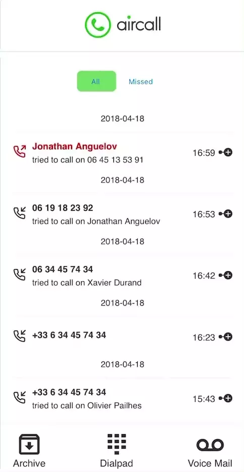

# LeapGrad Frontend Technical assessment

## Welcome! 👋

- Live Site URL: [Here](https://suspicious-bartik-12a41a.netlify.app)

## Table of contents 🙂

- [Overview](#overview)
  - [Screenshot](#screenshot)
  - [Built with](#built-with)
- [Author](#author)

## Overview 🍡

The goal of this test is to make a small ReactJS app that will list of calls, can archive a call...

## Screenshot 💻

  

## Built with 🧰

- React Js

## Author ✨

- Linkedin - [@Saliou](https://www.linkedin.com/in/saliou-diop-527741112/)
